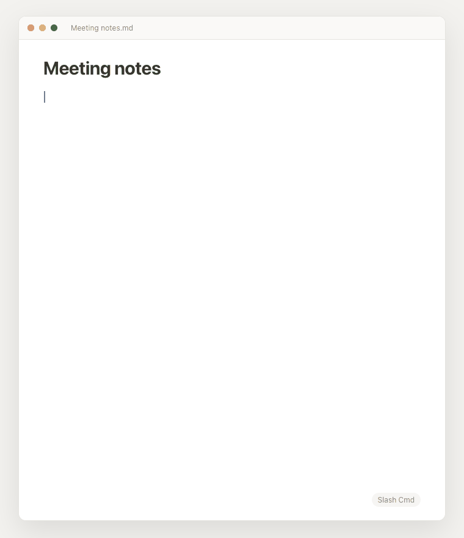

# Slash Cmd

A Notion-style `/` menu for the Obsidian editor. Type `/` and pick a block to
insert — headings, tables, callouts, code blocks, lists, and more. Keep typing
to filter, then press <kbd>Enter</kbd> to insert. Your cursor lands in the right
spot automatically.

## Usage

In any note, type `/` at the start of a line or after a space. A menu appears.
Filter by typing (e.g. `/tab` → Table, `/h1` → Heading 1), navigate with the
arrow keys, and press <kbd>Enter</kbd> to insert.

## Blocks

Heading 1 / 2 / 3 · Text · Bullet list · Numbered list · To-do · Quote ·
Callout · Code block · Table · Divider · Internal link · Math block ·
Today's date.

## Install

### From the community store

**Settings → Community plugins → Browse → search "Slash Cmd" → Install → Enable.**

### Manually

1. Download `main.js`, `manifest.json`, and `styles.css` from the
   [latest release](../../releases/latest).
2. Copy them into `<your vault>/.obsidian/plugins/slash-cmd/`.
3. **Settings → Community plugins → Enable Slash Cmd.**

### With BRAT

Add `Maniarasan-zuper/slash-cmd` in the
[BRAT](https://github.com/TfTHacker/obsidian42-brat) plugin.

## License

MIT © maniarasan.s
